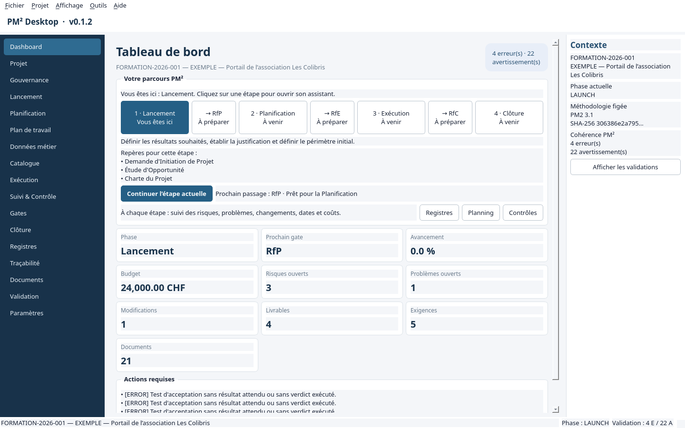

# 🧭 PM² Desktop 0.1.5

**Pilotez vos projets PM², du lancement à la clôture, dans une application locale en français.**

[](https://github.com/nouhailler/Pm2or/releases/tag/v0.1.5)


PM² Desktop est une application de gestion de projets locale, en français, fondée sur la méthodologie PM² v3.1 de la Commission européenne. Elle utilise PySide6/Qt6, SQLAlchemy 2 et SQLite et ne requiert aucun serveur ni accès Internet à l'exécution.

**[📦 Télécharger le .deb](https://github.com/nouhailler/Pm2or/releases/download/v0.1.5/pm2-desktop_0.1.5_amd64.deb)** · **[📖 Guide utilisateur](docs/GUIDE_UTILISATEUR.md)** · **[📝 Notes de version](docs/RELEASE_0.1.5.md)**

## ✨ Fonctions disponibles

- infobulles explicatives et accessibles sur les menus, boutons, onglets, champs,
  listes et tableaux, y compris dans les fenêtres créées dynamiquement ;
- fiches détaillées accessibles par double-clic ou touche Entrée sur toutes les lignes de
  tableaux, avec une présentation enrichie pour les documents et artefacts ;
- navigation par cinq tiroirs repliables : Vue d’ensemble, Étapes du projet, Pilotage,
  Données et documents, Outils avancés ; ouverture automatique du tiroir de l’écran demandé ;
- parcours graphique sur le tableau de bord : position réelle du projet, phases cliquables,
  revues de passage et raccourcis vers les assistants, registres, planning et contrôles ;
- assistants complets Lancement, Planification, Exécution et Clôture avec complétude,
  validations, données sources, artefacts, gates, acceptations et fermeture administrative ;
- gates RfP, RfE et RfC avec checklists issues de la configuration méthodologique ;
- gouvernance, personnes, rôles PM², parties prenantes et matrice RCmSCI ;
- WBS arborescente avec déplacement, réordonnancement, indentation/désindentation,
  archivage, tâches, jalons, dates, effort, coût, avancement et dépendances ;
- exigences, livrables, critères/tests d'acceptation et liens de traçabilité ;
- registres des risques, problèmes, décisions et modifications avec workflows contrôlés ;
- qualité, transition, mise en œuvre organisationnelle et réunions ;
- validation PM² agrégée et filtrable ;
- catalogue détaillé des 47 entités avec CRUD, relations, validation et audit ;
- exécution des tests d'acceptation et acceptation finale contrôlée depuis l'interface ;
- 21 artefacts spécialisés, avec saisie structurée, aperçu, versions et exports Markdown,
  HTML, DOCX et PDF ;
- sauvegarde et réouverture d'archives `.pm2` avec contrôle d'intégrité.

## 📥 Installation Debian

Téléchargez le paquet **Debian 13 amd64** dans les [releases GitHub](https://github.com/nouhailler/Pm2or/releases), puis exécutez :

```bash
sudo apt install ./pm2-desktop_0.1.5_amd64.deb
pm2-desktop
```

Un lanceur avec icône est installé dans le menu des applications. Python est embarqué dans le paquet.

> ℹ️ Le paquet nécessite glibc 2.41 ou ultérieure. La compatibilité avec Debian 12 et Ubuntu 24.04 n’est pas assurée.

Pour vérifier le téléchargement, placez le [fichier SHA256SUMS-0.1.5](https://github.com/nouhailler/Pm2or/releases/download/v0.1.5/SHA256SUMS-0.1.5) à côté du `.deb` :

```bash
sha256sum -c SHA256SUMS-0.1.5
```

## 🛠️ Installation développeur

Python 3.12 ou supérieur est requis.

```bash
git clone https://github.com/nouhailler/Pm2or.git
cd Pm2or
python3 -m venv .venv
.venv/bin/pip install -e '.[dev]'
```

Sous Windows, remplacez `.venv/bin/` par `.venv\Scripts\`.

## ▶️ Lancement

```bash
.venv/bin/pm2-desktop
```

Une base particulière peut être ouverte avec :

```bash
.venv/bin/pm2-desktop --database /chemin/vers/projet.db
```

Le diagnostic sans interface vérifie la base et la méthodologie :

```bash
.venv/bin/pm2-desktop --headless-check
```



### 🧭 Tester le parcours graphique

Ouvrez un projet puis sélectionnez **Vue d’ensemble → Tableau de bord**. Le bloc **Votre parcours PM²** indique
« Vous êtes ici ». Cliquez sur une phase pour ouvrir son assistant ou sur
**Continuer l’étape actuelle** pour reprendre le travail. Ces clics naviguent dans
l’application ; les changements de phase passent par une décision de revue.

Un [projet fictif d’entraînement](examples/portail-association.pm2) et son
[parcours d’exercices](examples/EXERCICES.md) sont fournis. Pour repartir du cas initial,
utilisez **Fichier → Ouvrir un projet…** et sélectionnez cette archive.

### Projet de démonstration : prochaine étape

Le cas **Les Colibris** est aujourd’hui un support d’entraînement : il commence en
lancement, avec un planning proposé, des documents en brouillon et des tests à exécuter.
Il doit être enrichi pour devenir un véritable projet de démonstration clé en main,
avec des données réalistes et cohérentes, des documents renseignés, des décisions,
des preuves d’acceptation et un parcours guidé couvrant le fonctionnement de l’outil.

Ce travail commencera le **15 septembre 2026**. Les priorités et le point de reprise
sont consignés dans [CONTEXT.md](CONTEXT.md). L’historique est disponible dans
[CHANGELOG.md](CHANGELOG.md).

### 💾 Stockage local

Les données applicatives sont conservées par défaut dans `~/.local/share/pm2-desktop`. La variable `PM2_DATA_DIR` permet de choisir un autre dossier.

## 🧪 Tests et contrôles

La version **0.1.5** a été validée avec **67 tests automatisés**, ainsi que Ruff et mypy. La suite couvre les parcours Qt du [plan de test](10_TEST_PLAN.md), un cycle de vie complet, les scénarios de gel méthodologique, les infobulles et les fiches détaillées des tableaux.

```bash
QT_QPA_PLATFORM=offscreen .venv/bin/pytest
.venv/bin/ruff check src tests scripts
.venv/bin/mypy src/pm2/domain src/pm2/application src/pm2/methodology
```

## 🏗️ Construction des paquets

```bash
./scripts/build.sh

# Assembler le paquet Debian à partir du bundle PyInstaller
.venv/bin/python scripts/package_deb.py
```

Le script exécute les contrôles puis construit `dist/pm2-desktop` avec PyInstaller. Consultez [le guide utilisateur](docs/GUIDE_UTILISATEUR.md) et [le guide développeur](docs/GUIDE_DEVELOPPEUR.md) pour la suite.

## 🔒 Méthodologie figée par projet

Le fichier `04_PM2_METHODOLOGY.yaml` est la source de vérité pour les phases, rôles, activités, artefacts, gates, responsabilités et règles PM² de la V0.1. Les widgets Qt ne définissent aucune règle méthodologique et toutes les transitions sont contrôlées par les services applicatifs.

Chaque nouveau projet fige l’identifiant, la version, un snapshot YAML canonique complet et son SHA-256. À la réouverture, les écrans utilisent exclusivement ce snapshot, et non le YAML installé. En cas d’écart, l’interface propose de conserver la méthodologie, examiner les différences ou effectuer une mise à niveau explicite et auditée.

Les archives `.pm2` (format 1.1) embarquent `methodology/PM2_METHODOLOGY.yaml` et vérifient sa cohérence avec le manifeste et SQLite. Les anciens projets sans snapshot ne peuvent être complétés automatiquement que si leur identifiant et leur version correspondent à ceux de la méthodologie installée ; le contenu historique exact ne peut pas être reconstitué a posteriori.

```text
projet.pm2
├── manifest.json
├── methodology/
│   └── PM2_METHODOLOGY.yaml
├── project.db
├── documents/
├── attachments/
└── exports/
```

## 📚 Documentation

| Ressource | Contenu |
| :--- | :--- |
| [📖 Guide utilisateur](docs/GUIDE_UTILISATEUR.md) | Prise en main de l’application |
| [🔧 Guide développeur](docs/GUIDE_DEVELOPPEUR.md) | Environnement et développement |
| [🏛️ Architecture](01_ARCHITECTURE.md) | Organisation et couches applicatives |
| [🗃️ Schéma de données](03_DATABASE_SCHEMA.md) | Tables, contraintes et migrations |
| [🔒 Méthodologie figée](docs/METHODOLOGIE_FIGEE.md) | Snapshots, intégrité et mises à niveau |
| [🧪 Plan de test](10_TEST_PLAN.md) | Scénarios de validation |
| [👁️ Recette visuelle V0.1](docs/RECETTE_VISUELLE_V0.1.md) | Contrôles des écrans |
| [📝 Notes de version 0.1.5](docs/RELEASE_0.1.5.md) | Nouveautés et installation |
| [Contexte et reprise](CONTEXT.md) | État du projet et prochain chantier |
| [Historique des changements](CHANGELOG.md) | Versions publiées et travaux à venir |
