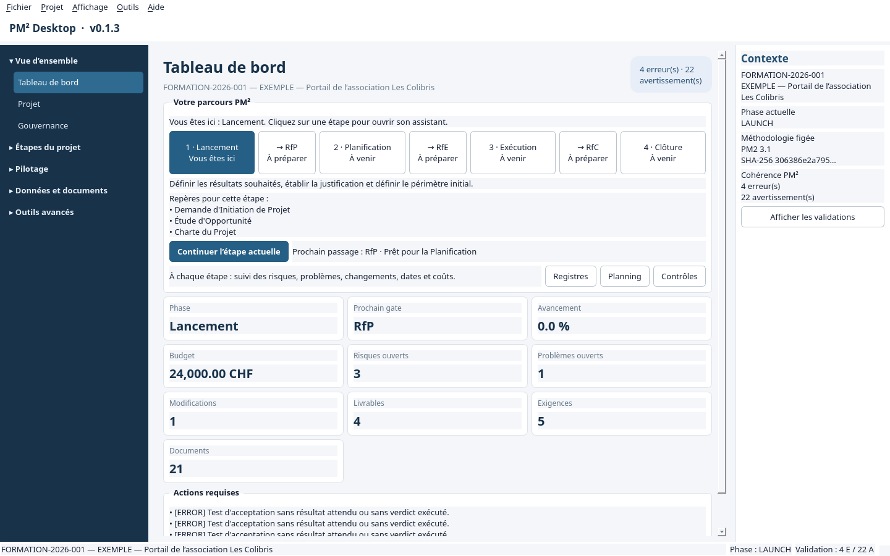

# Guide utilisateur — PM² Desktop V0.1

## Premier lancement

L'écran d'accueil propose de créer un projet ou d'ouvrir une archive `.pm2`. Pour créer un projet, saisissez au minimum son nom et sa référence. Le Chef de Projet (PM), le Porteur du Projet (PO), le budget et les dates peuvent être renseignés dans le même formulaire. La méthodologie est fixée à PM² v3.1 en français.

L'application enregistre automatiquement les données dans la base locale à la validation de chaque action. La barre inférieure indique le projet actif, sa phase et le nombre d'erreurs/avertissements.

## Aide contextuelle

Laissez le pointeur quelques instants sur un menu, un bouton, un onglet, un champ, une liste
ou un tableau pour afficher son infobulle. Elle précise l’effet de l’action ou la donnée
attendue. Les mêmes descriptions sont exposées aux technologies d’assistance. Une infobulle
spécifique à un écran est toujours prioritaire sur l’aide générique.

Dans tous les tableaux, double-cliquez sur une ligne — ou sélectionnez-la puis appuyez sur
**Entrée** — pour ouvrir une fiche avec les valeurs complètes de chaque colonne. Les documents
et artefacts utilisent une fiche enrichie qui présente également leur objectif et leur contenu.

## Navigation et cycle de vie

La barre latérale regroupe les écrans dans cinq tiroirs. Cliquez sur un titre pour déplier ou replier sa catégorie, puis sur un écran pour l’ouvrir.

- **Vue d’ensemble** : Tableau de bord, Projet et Gouvernance.
- **Étapes du projet** : les quatre assistants de phase, Plan de travail et Passages de phase.
- **Pilotage** : Suivi & Contrôle, Baselines, Audit Trail, Registres, Traçabilité et Conformité PM².
- **Données et documents** : Données du projet et Documents.
- **Outils avancés** : Catalogue des entités et Paramètres.

Replier un tiroir conserve l’écran affiché. Un raccourci ouvre automatiquement le tiroir de sa destination. Les catégories peuvent rester ouvertes simultanément. Le panneau de droite rappelle en permanence le contexte actif.

Chaque assistant Lancement, Planification, Exécution ou Clôture regroupe les artefacts de sa phase, affiche leur complétude et la synthèse des validations, et fournit des accès directs aux données sources. Les assistants concernés intègrent également le gate, l'exécution des tests d'acceptation, l'acceptation finale ou la fermeture administrative.

Le passage d'une phase à la suivante se fait dans **Passages de phase** :

1. ouvrez RfP, RfE ou RfC selon la phase courante ;
2. contrôlez chaque élément de la checklist et joignez mentalement/structurellement les preuves correspondantes ;
3. choisissez `APPROVED`, `REJECTED` ou `APPROVED_WITH_RESERVES` et indiquez le décideur ;
4. une approbation fait avancer le projet et écrit un événement d'audit.

Un élément obligatoire non satisfait bloque l'approbation avec un message explicite.

## Gouvernance et RCmSCI

Dans **Gouvernance**, ajoutez les membres de l'équipe et choisissez leur rôle PM². L'application bloque un second PM actif. L'onglet Parties prenantes conserve intérêt, influence et stratégie d'engagement. La matrice RCmSCI initiale est chargée depuis la méthodologie ; le bouton d'affectation permet d'ajouter des responsabilités projet. Un sujet ne peut avoir qu'un `R` et un `Cm`, tandis que `S`, `C` et `I` sont multiples.

## Plan de travail

Dans **Plan de travail**, créez un lot, une tâche ou un jalon. Sélectionner un élément avant la création le désigne comme parent. Les tâches enregistrent dates, effort, coût et progression ; les jalons utilisent une date unique. Les commandes permettent de renommer, monter, descendre, indenter, désindenter et archiver les éléments.

Les dépendances peuvent être ajoutées ou retirées dans la même vue. Elles sont contrôlées par le service de planification, qui interdit l'auto-dépendance, les liens entre projets et les cycles.

## Besoins, livrables et acceptation

La page **Données du projet** permet de créer :

- exigences avec source, priorité et méthode de vérification ;
- livrables avec responsable et état d'acceptation ;
- critères et tests d'acceptation ;
- contrôles qualité ;
- activités de transition et mise en œuvre ;
- réunions.

Utilisez **Traçabilité** pour relier exigences, tâches, livrables, tests, décisions et documents. Les relations sont typées et les liens critiques ne peuvent pas être supprimés.

Dans l'assistant d'Exécution ou de Clôture, l'onglet **Acceptation finale** permet d'enregistrer le verdict et la preuve de chaque test. Une acceptation finale est refusée tant que chaque critère applicable ne dispose pas d'un test exécuté avec succès.

## Registres et workflows

Les quatre onglets de **Registres** permettent recherche, filtrage, création et transition :

- Risque : `OPEN → ASSESSED → RESPONSE_PLANNED → MONITORED → CLOSED` ;
- Problème : `OPEN → ANALYSIS → ACTION_PLANNED → IN_PROGRESS → RESOLVED → CLOSED` ;
- Décision : `OPEN → ANALYSIS → DECIDED → COMMUNICATED → CLOSED` ;
- Modification : `DRAFT → SUBMITTED → IMPACT_ANALYSIS → APPROVAL → APPROVED/REJECTED → IMPLEMENTING → VERIFIED → CLOSED`.

Une modification ne peut entrer en implémentation sans approbation formelle. Un problème ne peut être clôturé sans résolution.

## Baselines et écarts

Dans **Baselines**, créez une référence nommée et indiquez son type et son auteur. L'application attribue une référence `B-001`, `B-002`, etc., capture le budget, le Work Plan, les jalons, les exigences, les livrables, les risques et les documents, puis signe ce snapshot avec SHA-256.

Une baseline ne peut ensuite être ni modifiée ni supprimée. Elle peut être approuvée une seule fois en indiquant l'approbateur. **Comparer à l'état actuel** présente chaque ajout, retrait et modification depuis la référence. Lorsqu'un changement doit devenir la nouvelle référence officielle, créez une nouvelle baseline au lieu de modifier l'ancienne.

## Audit Trail

La page **Audit Trail** consolide toutes les opérations du projet dans une timeline. Chaque ligne indique la date, l'objet métier, l'action, l'utilisateur et l'origine. La sélection d'un événement affiche sa raison, les champs modifiés ainsi que les valeurs complètes **Avant** et **Après**.

Les filtres permettent de limiter le journal à un type d'objet, un utilisateur ou une recherche libre. **Exporter le journal JSON** produit une copie exploitable contenant les mêmes métadonnées et valeurs, sans modifier l'historique en base.

Le bouton **Fiche détaillée** ouvre les données, relations, validations et événements d'audit de la ligne. Le **Catalogue des entités** offre la même vue pour les 49 entités contractuelles, avec création, modification, archivage et restauration lorsque l'entité le permet. Les baselines y sont en lecture seule ; les changements de statut restent exclusivement pilotés par les workflows métier.

## Centre de conformité PM²

La page **Conformité PM²** transforme les contrôles de cohérence en plan d'action. Elle affiche le score global, la progression du Lancement, de la Planification, de l'Exécution, du Suivi & Contrôle et de la Clôture, ainsi que les erreurs et avertissements qui affectent chaque domaine. Une phase future apparaît comme **Non commencée** plutôt que comme non conforme.

Les onglets RfP, RfE et RfC détaillent chaque condition obligatoire et indiquent si le gate est **BLOQUÉ**, **PRÊT** ou **APPROUVÉ**. **Examiner le gate** ouvre sa checklist et ses preuves.

Les écarts identiques sont regroupés : trois livrables sans critère d'acceptation donnent ainsi une seule ligne avec un compteur de trois. Chaque ligne propose une action comme **Créer les critères**, **Relier les tests**, **Créer une relation** ou **Corriger**. Le bouton ouvre la page et l'onglet métier pertinents ; après correction, utilisez **Recalculer**. Le filtre permet de se concentrer sur les erreurs, avertissements ou informations. Les erreurs bloquent les gates concernés, mais n'empêchent pas un export ordinaire ; le rapport d'export les mentionne.

## Documents et archives

Dans **Documents**, sélectionnez l'un des 21 artefacts spécialisés et un format : Markdown, HTML, DOCX ou PDF. Les contenus sont régénérés depuis les données structurées de leur assistant et les registres courants. L'aperçu HTML, le dossier d'export et l'historique des versions sont accessibles depuis cette page.

Dans **Pièces jointes**, ajoutez les preuves et fichiers de référence du projet. Chaque fichier est limité à 25 Mio, stocké dans la base avec son type et son empreinte SHA-256, et peut être ouvert ou retiré depuis cet écran. Une pièce retirée reste tracée dans l'audit mais ne peut plus être ouverte.

**Exporter le projet .pm2** produit une archive ZIP spécialisée contenant :

- `project.db` ;
- `manifest.json` avec version, projet, méthodologie, date et empreinte ;
- `documents/`, `attachments/` et `exports/` ;
- les rapports d'export et de validation lors d'un export complet.

À l'ouverture, l'empreinte est contrôlée avant toute écriture. Une archive corrompue affiche une erreur et la copie locale existante reste intacte.
